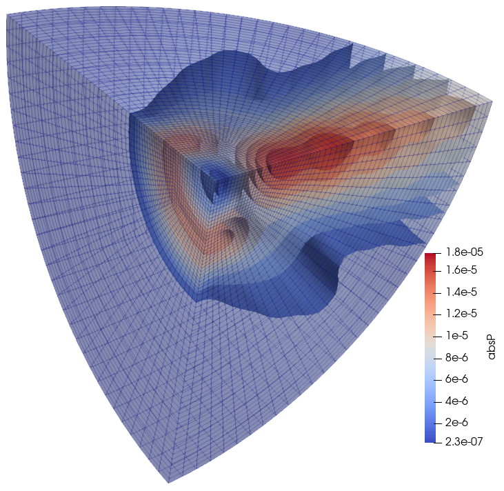

# Baffled piston in a half-sphere domain

## Description

Baffled piston in a half-sphere domain with Absorbing Boundary Condition (ABC).



## Goals

-

```julia
#
```

## Definitions

The finite element code realize on the basic functionality implemented in this
package.

```julia
using FinEtools
```

The acoustics functionality is brought in:

```julia
using FinEtoolsAcoustics
```

We shall need some facilities from the linear algebra package

```julia
using LinearAlgebra
```

The input quantities are provided including the units:

```julia
rho = 1.21*phun("kg/m^3");# mass density
c  = 343.0*phun("m/s");# sound speed
bulk =  c^2*rho;
omega =  7500*phun("rev/s");      # frequency of the piston
a_piston =  -1.0*phun("mm/s")     # amplitude of the piston acceleration
R = 50.0*phun("mm");# radius of the piston
Ro = 150.0*phun("mm"); # radius of the enclosure
nref = 4;#number of refinements of the sphere around the piston
nlayers = 35;                     # number of layers of elements surrounding the piston
tolerance = R/(2^nref)/100
```

Hexahedral mesh

```julia
fens,fes  =  H8sphere(R,nref);
bfes  =  meshboundary(fes)
File  =   "baffledabc_boundary.vtk"
vtkexportmesh(File, connasarray(bfes), fens.xyz, FinEtools.MeshExportModule.VTK.Q4)
@async run(`"paraview.exe" $File`)

l = selectelem(fens, bfes, facing = true, direction = [1.0 1.0  1.0], dotmin= 0.001)
ex(xyz, layer) = (R+layer/nlayers*(Ro-R))*xyz/norm(xyz)
fens1, fes1  =  H8extrudeQ4(fens, subset(bfes,l), nlayers, ex);
fens, newfes1, fes2 =  mergemeshes(fens1, fes1, fens, fes, tolerance)
fes = cat(newfes1,fes2)
```

Piston surface mesh

```julia
bfes  =  meshboundary(fes)
l1 = selectelem(fens, bfes, facing = true, direction = [-1.0 0.0 0.0])
l2 = selectelem(fens, bfes, distance = R, from = [0.0 0.0 0.0], inflate = tolerance)
piston_fes = subset(bfes,intersect(l1,l2));
```

Outer spherical boundary

```julia
louter = selectelem(fens, bfes, facing = true, direction = [1.0 1.0  1.0], dotmin= 0.001)
outer_fes = subset(bfes,louter);
```

Region of the fluid

```julia
material = MatAcoustFluid(bulk, rho)
region1 =  FDataDict("femm"=>FEMMAcoust(IntegDomain(fes, GaussRule(3, 2)), material))
```

Surface for the ABC

```julia
abc1  =  FDataDict("femm"=>FEMMAcoustSurf(IntegDomain(outer_fes, GaussRule(2, 2)), material))
```

Surface of the piston

```julia
flux1  =  FDataDict("femm"=>FEMMAcoustSurf(IntegDomain(piston_fes, GaussRule(2, 2)), material),  "normal_flux"=> -rho*a_piston+0.0im);
```

Make model data

```julia
modeldata =  FDataDict("fens"=>  fens, "omega"=>omega, "regions"=>[region1], "flux_bcs"=>[flux1], "ABCs"=>[abc1])
```

Call the solver

```julia
modeldata = FinEtoolsAcoustics.AlgoAcoustModule.steadystate(modeldata)

geom = modeldata["geom"]
P = modeldata["P"]

File  =   "baffledabc.vtk"
vtkexportmesh(File, connasarray(fes), geom.values, FinEtools.MeshExportModule.VTK.H8;
scalars = [("absP", abs.(P.values))])
@async run(`"paraview.exe" $File`)

true
```

---

*This page was generated using [Literate.jl](https://github.com/fredrikekre/Literate.jl).*

