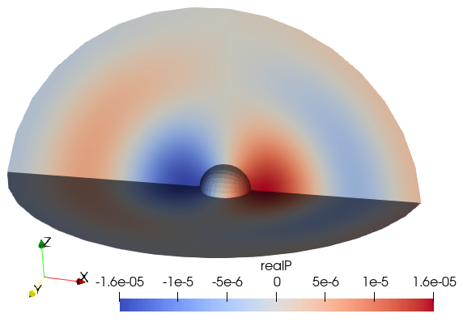

# Moving sphere in an infinite fluid

## Description

A rigid sphere in an infinite volume of fluid accelerates alternately in the
positive and negative x-direction, generating positive pressure ahead of it,
negative pressure behind. Time-dependent simulation. Described in [1].

## References

[1] Krysl P, Hawkins AD, Schilt C, Cranford TW (2012): Angular Oscillation of
Solid Scatterers in Response to Progressive Planar Acoustic Waves: Do Fish
Otoliths Rock?. PLOS ONE 7(8): e42591. https://doi.org/10.1371/journal.pone.0042591



## Goals

- Show how to generate hexahedral mesh, mirroring and merging together parts.
- Execute transient simulation by the trapezoidal-rule time stepping of [1].

```julia
#
```

## Definitions

The finite element code relies on the basic functionality implemented in this
package.

```julia
using FinEtools
```

The acoustics functionality is brought in:

```julia
using FinEtoolsAcoustics
```

We shall need some facilities from the linear algebra package

```julia
using LinearAlgebra
```

The properties correspond roughly to air.

```julia
rho = 1.21*phun("kg/m^3");# mass density
c  = 343.0*phun("m/s");# sound speed
bulk =  c^2*rho;
a_amplitude=1.0*phun("mm/s^2");# amplitude of the  acceleration of the sphere
R = 50.0*phun("mm"); # radius of the interior sphere
Ro = 8*R # radius of the external sphere, where the fluid doing this truncated
P_amplitude = R*rho*a_amplitude; # pressure amplitude
frequency = 1200.; # # frequency of the incident wave, Hz
omega = 2*pi*frequency;
dt = 1.0/frequency/20;
tfinal = 90*dt;
nsteps = round(tfinal/dt)+1;
```

This dictates the parameters of the mesh.

```julia
nref = 2;
nlayers = 40;
tolerance  =  Ro/(nlayers)/100
```

Hexahedral mesh: Generate 1/8 of the scattering sphere. This sphere is not
actually part of the model, it just serves as an intermediate step from which
the volume of the fluid will be produced.

```julia
fens, fes  =  H8sphere(R, nref);
```

No mirror the 1/8 of the sphere to build one fourth of the complete
three-dimensional geometry. In other words we are using two symmetric planes
here. Note that in order to mirror the hexahedral elements correctly, we need
to specify the renumbering rule for the connectivity.

```julia
fens1, fes1  =  mirrormesh(fens, fes, [-1.0, 0.0, 0.0], [0.0, 0.0, 0.0], renumb =  r(c) = c[[1, 4, 3, 2, 5, 8, 7, 6]]);
```

Now merge the two pieces (1/8) together.

```julia
fens,newfes1,fes2 =  mergemeshes(fens1, fes1, fens, fes, tolerance)
fes = cat(newfes1,fes2)
```

Derive the finite element set for the boundary of the target.

```julia
bfes  =  meshboundary(fes)
```

To identify the outer spherical boundary we'll use this function to calculate
its normal.

```julia
function dout(xyz)
    return xyz/norm(xyz)
end
```

Select the part of the boundary of the target facing towards infinity.

```julia
louter = selectelem(fens, bfes, facing = true, direction = dout)
outer_fes = subset(bfes, louter);
```

The surface of the spherical target is now extruded into multiple layers.

```julia
fens,fes  = H8extrudeQ4(fens, outer_fes, nlayers, (xyz, layer)->(R+layer/nlayers*(Ro-R))*xyz/norm(xyz));
```

In case there are any unconnected nodes, remove them, and renumber the elements.

```julia
connected = findunconnnodes(fens, fes);
fens, new_numbering = compactnodes(fens, connected);
fess = renumberconn!(fes, new_numbering);
```

The geometry and the solution (pressure) fields.

```julia
geom  =  NodalField(fens.xyz)
P  =  NodalField(zeros(FCplxFlt,size(fens.xyz,1),1))
```

We need to identify the surface of the scattering sphere, and also the outside
sphere where the fluid immediately surrounding the sphere is adjacent to the
infinite extent of the fluid.

```julia
bfes  =  meshboundary(fes)
```

Find the two spherical surfaces, one can be located by the distance criterion
(from the center), and the other one by facing to infinity (away from the
center).

```julia
linner = selectelem(fens, bfes, distance = R, from = [0.0 0.0 0.0], inflate = tolerance)
louter = selectelem(fens, bfes, facing = true, direction = dout)

#
```

## Visualize the geometry

Export three VTK files: one for the interior of the fluid, and two for the boundaries.
The boundaries on the symmetry planes are taken into account implicitly.

```julia
File  =   "Sphere-fluid-interior.vtk"
vtkexportmesh(File, fes.conn, fens.xyz, FinEtools.MeshExportModule.VTK.H8)
File  =   "Sphere-fluid-inner-boundary.vtk"
vtkexportmesh(File, subset(bfes, linner).conn, geom.values, FinEtools.MeshExportModule.VTK.Q4)
File  =   "Sphere-fluid-outer-boundary.vtk"
vtkexportmesh(File, subset(bfes, louter).conn, geom.values, FinEtools.MeshExportModule.VTK.Q4)
```

If we have paraview, we can run it now.

```julia
@async run(`"paraview.exe" $File`)

#
```

## Set up the discrete model

Number the degrees of freedom in the pressure field.

```julia
numberdofs!(P)
```

Create the finite element machine for the fluid.

```julia
material = MatAcoustFluid(bulk,rho)
femm  =  FEMMAcoust(IntegDomain(fes, GaussRule(3, 2)), material)
```

Use the machine calculate the acoustic stiffness and mass matrices.

```julia
S  =  acousticstiffness(femm, geom, P);
C  =  acousticmass(femm, geom, P);
```

Set up finite element machine needed for the absorbing boundary conditions.

```julia
abcfemm  =  FEMMAcoustSurf(IntegDomain(subset(bfes, louter), GaussRule(2, 2)), material)
```

This is the "damping" mmatrix for the ABC.

```julia
D  =  acousticABC(abcfemm, geom, P);
```

The sphere at the center is rigid and moves in a prescribed, harmonic,
fashion. That generates loading onto the fluid. We expect the loading to be
in the form of a dipole.

```julia
function dipole(dpdn, xyz, J, label, t)
    n = cross(J[:,1],J[:,2]);
    n = vec(n/norm(n));
    dpdn[1] = -rho*a_amplitude*sin(omega*t)*n[1]
end
```

In order to evaluate the distributed pressure flux loading we need a surface
acoustic finite element model machine. We shall set it up for the interior
spherical surface.

```julia
dipfemm  =  FEMMAcoustSurf(IntegDomain(subset(bfes, linner), GaussRule(2, 2)), material)

#
```

## Time stepping

Solve the transient acoustics equations. Refer to [1] for details of the
formulation.

The loop executes inside this local scope.

```julia
P1 = let
    P0 = deepcopy(P)
    P0.values[:] .= 0.0; # initially all pressure is zero
    vP0 = gathersysvec(P0);
```

vP1 = zeros(eltype(vP0), size(vP0));

```julia
    vQ0 = zeros(eltype(vP0), size(vP0));
```

vQ1 = zeros(eltype(vP0), size(vP0));
This will be the output of this computation: the final value of the
pressure field

```julia
    P1 = deepcopy(P0);

    t = 0.0; # Initial time
```

Compute the initial load due to the pressure gradient on the surface of
the moving sphere.

```julia
    fi  =  ForceIntensity(FCplxFlt, 1, (dpdn, xyz, J, label)->dipole(dpdn, xyz, J, label, t));
    La0 = distribloads(dipfemm, geom, P1, fi, 2);
```

This is the coefficient matrix that needs to be used in the solves. We are
not being very careful here to save on computation: it might be best to
factorize this matrix, and then use backward and forward solves inside
the loop.

```julia
    A = (2.0/dt)*S + D + (dt/2.)*C;

    step = 0;
    while t <= tfinal
        step = step  + 1;
        println("Time $t ($(step)/$(round(tfinal/dt)+1))")
        t = t+dt;
```

Compute the current load due to the pressure gradient on the surface of
the moving sphere.

```julia
        fi  = ForceIntensity(FCplxFlt, 1, (dpdn, xyz, J, label)->dipole(dpdn, xyz, J, label, t));
        La1 = distribloads(dipfemm, geom, P1, fi, 2);
```

Solve for the rate of the pressure

```julia
        vQ1 = A\((2/dt)*(S*vQ0)-D*vQ0-C*(2*vP0+(dt/2)*vQ0)+La0+La1);
```

Update the value of the pressure

```julia
        vP1 = vP0 + (dt/2)*(vQ0+vQ1);
```

Swap variables for next step

```julia
        vP0 = vP1;
        vQ0 = vQ1;
        P1 = scattersysvec!(P1, vec(vP1));
        P0 = P1;
        La0 = La1;
    end

    P1 # Return the final pressure
end

#
```

## Visualization

```julia
File  =   "sphere_dipole_P1.vtk"
vtkexportmesh(File, fes.conn, geom.values, FinEtools.MeshExportModule.VTK.H8; scalars = [( "realP", real.(P1.values)),])
@async run(`"paraview.exe" $File`)


true
```

---

*This page was generated using [Literate.jl](https://github.com/fredrikekre/Literate.jl).*

