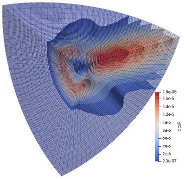

# Baffled piston in a half-sphere domain

Source code: [`baffled_piston_tut.jl`](baffled_piston_tut.jl)

## Description

Baffled piston in a half-sphere domain with Absorbing Boundary Condition (ABC).
This is a steady-state simulation.



## Goals

- Show how to construct structured multi-block mesh.
- Demonstrate the use of an algorithm to run the simulation.

````julia
#
````

## Definitions

The finite element code relies on the basic functionality implemented in this
package.

````julia
using FinEtools
````

The acoustics functionality is brought in:

````julia
using FinEtoolsAcoustics
````

We shall need some facilities from the linear algebra package.

````julia
using LinearAlgebra
````

The input quantities are provided including the units:

````julia
rho = 1.21*phun("kg/m^3");# mass density
c  = 343.0*phun("m/s");# sound speed
bulk =  c^2*rho;
omega =  7500*phun("rev/s");      # frequency of the piston
a_piston =  -1.0*phun("mm/s")     # amplitude of the piston acceleration
R = 50.0*phun("mm");# radius of the piston
Ro = 150.0*phun("mm"); # radius of the enclosure
nref = 4;#number of refinements of the sphere around the piston
nlayers = 35;                     # number of layers of elements surrounding the piston
tolerance = R/(2^nref)/100
````

Hexahedral mesh is generated for one octant of a sphere.

````julia
fens,fes  =  H8sphere(R,nref);
````

The boundary of this mesh is found:

````julia
bfes  =  meshboundary(fes)
````

And it is exported for visualization.

````julia
File  =   "baffledabc_boundary.vtk"
vtkexportmesh(File, connasarray(bfes), fens.xyz, FinEtools.MeshExportModule.VTK.Q4)
@async run(`"paraview.exe" $File`)
````

The spherical part of the surface mesh is now extruded the form layers.

````julia
l = selectelem(fens, bfes, facing = true, direction = [1.0 1.0  1.0], dotmin= 0.001)
ex(xyz, layer) = (R+layer/nlayers*(Ro-R))*xyz/norm(xyz)
fens1, fes1  =  H8extrudeQ4(fens, subset(bfes,l), nlayers, ex);
````

The previous volume mesh is now merged with the newly extruded elements.

````julia
fens, newfes1, fes2 =  mergemeshes(fens1, fes1, fens, fes, tolerance)
fes = cat(newfes1,fes2)
````

Piston surface mesh is derived from the boundary of this new collection of
volume elements.

````julia
bfes  =  meshboundary(fes)
````

We use two criteria to capture the surface elements that form the piston.

````julia
l1 = selectelem(fens, bfes, facing = true, direction = [-1.0 0.0 0.0])
l2 = selectelem(fens, bfes, distance = R, from = [0.0 0.0 0.0], inflate = tolerance)
piston_fes = subset(bfes,intersect(l1,l2));
````

Outer spherical boundary is extracted by using the orientation of the surface
mesh.

````julia
louter = selectelem(fens, bfes, facing = true, direction = [1.0 1.0  1.0], dotmin= 0.001)
outer_fes = subset(bfes,louter);
````

The simulation is driven by setting up and then executing an algorithm. For
this purpose we store the data in a "model data dictionary".

Region of the fluid. Define the finite element machine for the fluid region.

````julia
material = MatAcoustFluid(bulk, rho)
region1 =  FDataDict("femm"=>FEMMAcoust(IntegDomain(fes, GaussRule(3, 2)), material))
````

Define the finite element machine for the ABC (absorbing boundary condition).

````julia
abc1  =  FDataDict("femm"=>FEMMAcoustSurf(IntegDomain(outer_fes, GaussRule(2, 2)), material))
````

The normal flux is prescribed on the surface of the piston in terms of the
known acceleration.

````julia
flux1  =  FDataDict("femm"=>FEMMAcoustSurf(IntegDomain(piston_fes, GaussRule(2, 2)), material),  "normal_flux"=> -rho*a_piston+0.0im);
````

Make model data dictionary. It completely defines the parameters of the
problem.

````julia
modeldata =  FDataDict("fens"=>fens, "omega"=>omega, "regions"=>[region1], "flux_bcs"=>[flux1], "ABCs"=>[abc1])
````

Call the solver. The model data is returned enriched of the solution
parameters, such as the pressure field `P`.

````julia
modeldata = FinEtoolsAcoustics.AlgoAcoustModule.steadystate(modeldata)
````

Extract geometry field and the pressure field for postprocessing.

````julia
geom = modeldata["geom"]
P = modeldata["P"]
````

Write out the postprocessing data is a VTK file. Dump both the magnitude and
the components of the solution (complex field).

````julia
File  =   "baffledabc.vtk"
vtkexportmesh(File, connasarray(fes), geom.values, FinEtools.MeshExportModule.VTK.H8; scalars = [("absP", abs.(P.values)), ("realP", real.(P.values)), ("imagP", imag.(P.values))])
````

If the `paraview` program is installed, run it.

````julia
@async run(`"paraview.exe" $File`)

true
````

---

*This page was generated using [Literate.jl](https://github.com/fredrikekre/Literate.jl).*

